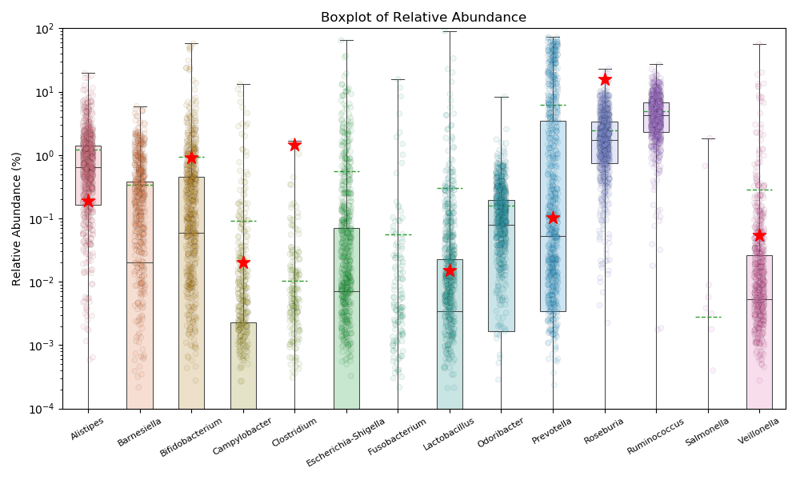

# Analysis of 2017 Gut Microbiome Paper by uBiome
###### Almonacid DE, Kraal L, Ossandon FJ, Budovskaya YV, Cardenas JP, Bik EM, et al. (2017)
###### 16S rRNA gene sequencing and healthy reference ranges for 28 clinically relevant microbial taxa from the human gut microbiome. PLoS ONE 12(5): e0176555.
## Comparison with user raw JSON results

In May 2017, uBiome published an [open access paper](http://journals.plos.org/plosone/article?id=10.1371/journal.pone.0176555) that discusses the 16S rRNA sequencing results for 28 clinically relevant microbial taxa from the human gut, from a total of 897 healthy subjects.
The paper in PDF format and its associated data is placed [here](./RawData).

My goal was to compare the microbial taxa found in my raw uBiome 16S sequencing results (for the gut) with the data from the 897 healthy participants in uBiome's study.

One of the key plots in the paper - a boxplot (in Fig 3) showing the relative percentages of genera - is reproduced through a Python script that parses the uBiome study's raw .xlsx data file. This data is then compared with my own raw JSON data from my most recent uBiome sample. 

Note the following about the plot:
- The reproduced boxplot only shows genera, not species, since uBiome's species-level data still has a lot of uncertainty and most species that are shown in the paper are not present in my sample.
- Only those genera that are present in *both* my sample *and* uBiome's study are plotted, to show a comparison. This can vary dynamically if a new JSON result file is read in.
- The Y-axis is **logarithmic**, to account for large relative percentage differences.
- The red star represents the calculated value from my sample.
- The solid green line represents the median value for the 897 study participants from uBiome's study.
- The dashed green line represents the mean value for the 897 study participants from uBiome's study.

Through this comparison plot, it is relatively easy to google which genera are associated with health or disease. Fig. 5 in the paper gives some useful insights into the specific genera studied.

As gut microbiome research continually evolves, it's exciting to keep a track of what's in us, and what might change in future!

## Example plot

## uBiome Study Plot (Fig.3 )

