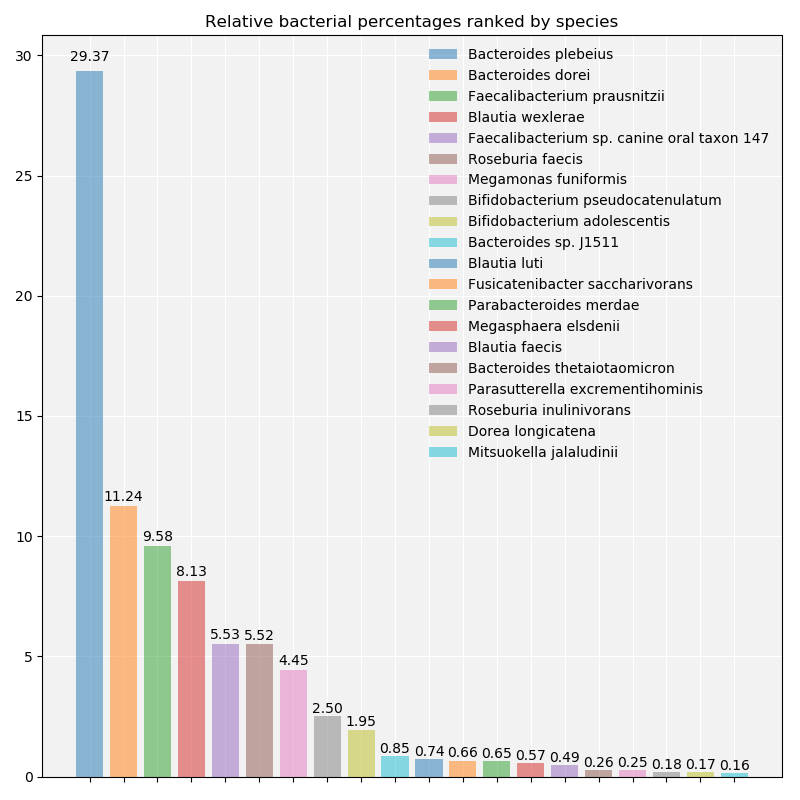
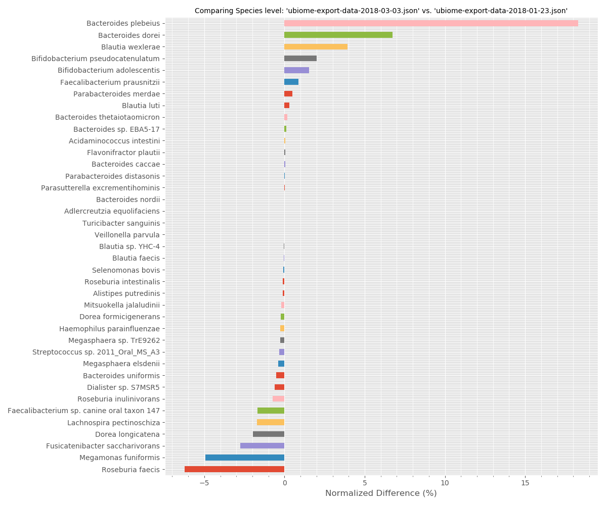

# Explore individual uBiome JSON raw files

Visualize either an individual uBiome raw JSON file's results, or compare two results to see which bacterial taxonomies changed the most.

Requires pandas and matplotlib:

`pip install -r requirements.txt`

## Individual plot (from `ubiome_individual.py`)
Bar charts are used to visualize the data (instead of pie/donut charts like in the uBiome web interface) to avoid overwhelming amounts of information. Looking at just the top 20 taxonomic entities allows one to identify the most important entities from the sample, which can then be explored through google searches.

## Comparison plots (from `ubiome_compare.py`)
Horizontal bar charts plot the normalized taxonomy counts. Positive means the newer sample has a higher count than the older sample, and vice versa. Comparing the top and bottom of the plot shows what main groups changed the most between the two samples. 

