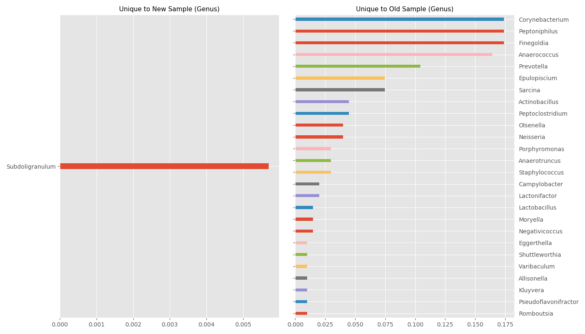

# Explore individual uBiome JSON raw files
I wrote about this exercise and how I explored my uBiome raw data on [Medium.](https://medium.com/@laminarflow027/the-effect-of-a-high-fiber-diet-on-my-microbiome-d426c6bc29f8)

These Python scripts do the following:

- Visualize either an individual uBiome raw JSON file's results
- Compare two results to see which bacterial taxonomies changed the most. 
- Plot unique groups in old and new sample, to see which ones changed the most.

Requires pandas and matplotlib:

`pip install -r requirements.txt`

## `ubiome_individual.py`
### Individual Plots
Bar charts are used to visualize the data (instead of pie/donut charts like in the uBiome web interface) to make the taxonomies more visually accessible. Looking at just the top 20 taxonomic entities allows one to identify the most significant entities from the sample, which can then be explored through google searches.

## `ubiome_compare.py`
### Comparison plots
Horizontal bar charts show the normalized taxonomy counts. Positive means the newer sample has a higher count than the older sample, and vice versa. Comparing the top and bottom of the plot shows what main groups changed the most between the two samples. 

### Unique Sample Plots
Subplots containing unique samples from old and new samples. Shows how a particular taxonomic rank changed over time. This gives a qualitative trend as to how a particular dietary shift over a small time period affected particular families/genera. If there is no unique organism of a particular rank, a blank zero series is plotted to avoid errors.

